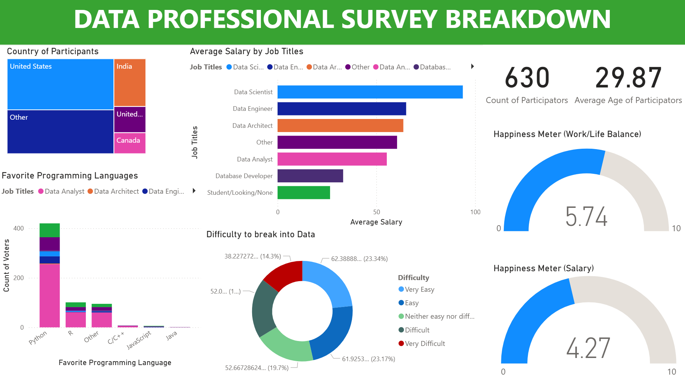

# Data Professional Survey Analysis (Power BI)

This Power BI dashboard analyzes survey data from data professionals around the world.
It explores patterns in job titles, salary trends, work/life balance, tool preferences, and perceived difficulty in breaking into the data industry.

---

## Dashboard Preview

---

## Key Insights

- **Job Title & Salary**: Data Engineers report the highest average salaries; Students and Junior roles trail behind.
- **Happiness Index**: Participants rated their work/life balance higher than their salary satisfaction.
- **Top Programming Language**: Python dominates as the most favored language among all job roles.
- **Difficulty to Break Into Data**: A significant portion of participants found the field challenging to enter.
- **Demographics**: Majority of responses came from the United States and other English-speaking countries.

---

## Files Included

- `data survey dashboard.pbix` - Fully interactive Power BI dashboard file  
- `data survey dataset.xlsx` - Cleaned Excel file used as data source  
- `dashboard-preview.png` - Static preview of final dashboard  

---

## Tools Used

- **Power BI Desktop (.pbix)**  

---

## How to View

1. Download the `.pbix` file  
2. Open it in Power BI Desktop
3. Interact with filters, slicers, and charts for insights

---

## Project Purpose

This self-driven project was built to practice Power BI dashboard creation and survey data analysis.
It simulates real-world reporting on team and business-level metrics within the data industry.

