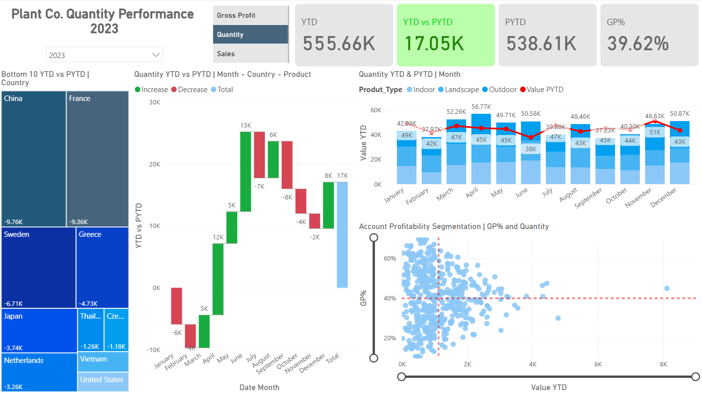

# Plant Co. Power BI Sales Performance Dashboard

An interactive Power BI dashboard analyzing plant sales performance from 2022 to 2024, focusing on year-over-year trends, profitability, and segmentation across accounts, countries, and product types.

> Final report is filtered to **2023 & 2024** only, as 2022 data does not support previous-year comparisons.

---

## Dashboard Preview

---

## Dataset Structure

**Source**: Excel file with the following sheets:
- `Fact_Sales` - transactional sales data (quantity, prices, cost, date, product/account IDs)
- `Dim_Product` - product hierarchy (name, type, family, group)
- `Dim_Account` - customer/account data (region, location, name)

**Custom tables created:**
- `Dim_Date` - continuous date table (Jan 2022 to Dec 2024)
- `Slc_Values` - disconnected slicer for metric switching (`Sales`, `Quantity`, `Gross Profit`)

---

## Key Metrics & DAX Logic

- **Sales**, **Quantity**, **Gross Profit**
- **YTD** & **PYTD** for all metrics (via `TOTALYTD` + `SAMEPERIODLASTYEAR`)
- **Dynamic Measures** using `SWITCH` based on selected metric
- **Gross Profit % (GP%)** calculated via `DIVIDE([Gross Profit], [Sales])`
- **InPast flag** (TRUE/FALSE) in `Dim_Date` to define boundaries for PYTD

---

## Dashboard Features

| Element                        | Description |
|--------------------------------|-------------|
| KPI Cards                      | YTD, PYTD, YTD vs PYTD, GP% (all dynamic) |
| Treemap                        | Bottom 10 countries by YTD vs PYTD drop |
| Waterfall Chart                | YTD vs PYTD breakdown by month |
| Combo Bar + Line Chart         | Monthly YTD vs PYTD comparison |
| Scatter Plot                   | Customer segmentation by GP% and Quantity |
| Year Slicer                    | Filters data to 2023 & 2024 |
| Metric Selector (Slicer)       | Switch between Sales, Quantity, Gross Profit |
| Dynamic Visual Titles          | Controlled using `SELECTEDVALUE` |
| Conditional Formatting         | Highlights negative trends |
| Drilldown Enabled              | By product, country, and time hierarchy |

---

## Data Modeling Approach

- **Star Schema**: Fact table linked to `Dim_Product`, `Dim_Account`, `Dim_Date`
- **One-to-Many Relationships** with surrogate keys
- **Disconnected Tables**: Used for metric slicer logic
- **Display Folders**: Organized measures (`YTD`, `PYTD`, `SWITCH`, etc.)
- **Hidden Columns/Helpers**: Clean model view for users

---

## Tools Used

- Power BI Desktop
- Power Query Editor
- DAX (`CALCULATE`, `SWITCH`, `TOTALYTD`, `SAMEPERIODLASTYEAR`, `DIVIDE`, `SELECTEDVALUE`)
- Conditional formatting and dynamic titles

---

## Insights Unlocked

- Drop in Quantity performance in March–April 2024 vs PYTD
- Underperformance by countries like Canada and USA in 2024
- Profitability cluster analysis reveals high GP% vs high-volume accounts
- Report built for **flexible, user-driven metric switching and drilldown**

---

## Files Included

- `performance-report.pbix` - Fully interactive Power BI file
- `plant sales dataset.xls` - Source data (cleaned)
- `dashboard.png` - Static preview of final dashboard

---

## How to View

1. Download this folder  
2. Open `performance-report.pbix` in Power BI Desktop  
3. Interact with visuals, slicers, and insights  

---

## Project Purpose

This project demonstrates dynamic performance reporting using Power BI. It focuses on YOY analysis, profitability, and segmentation – essential for understanding sales trends across multiple dimensions.
